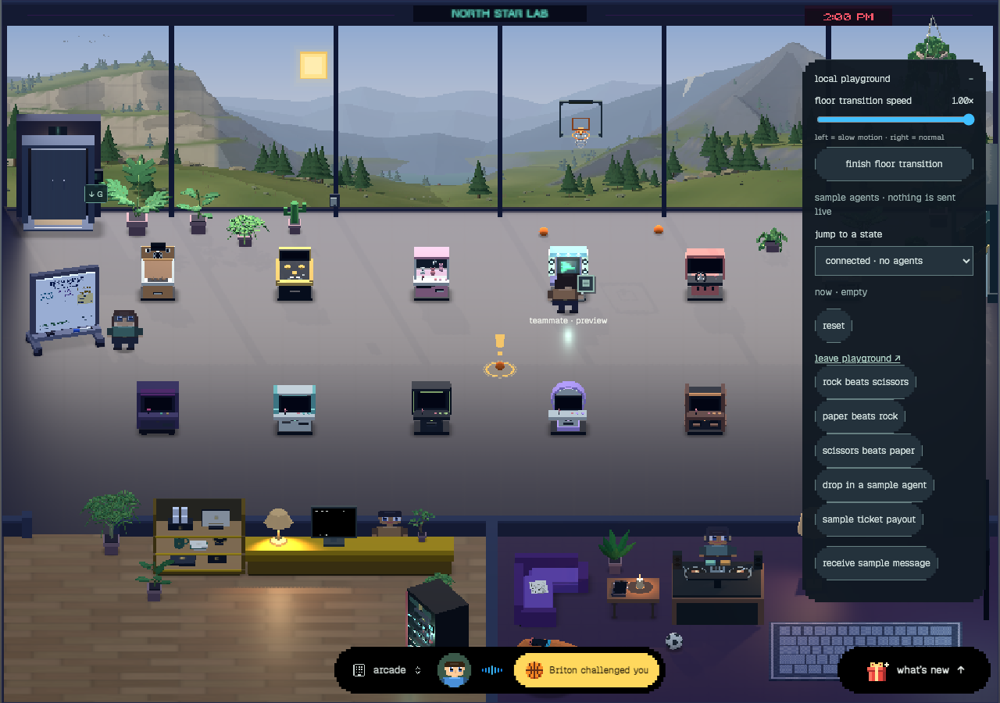
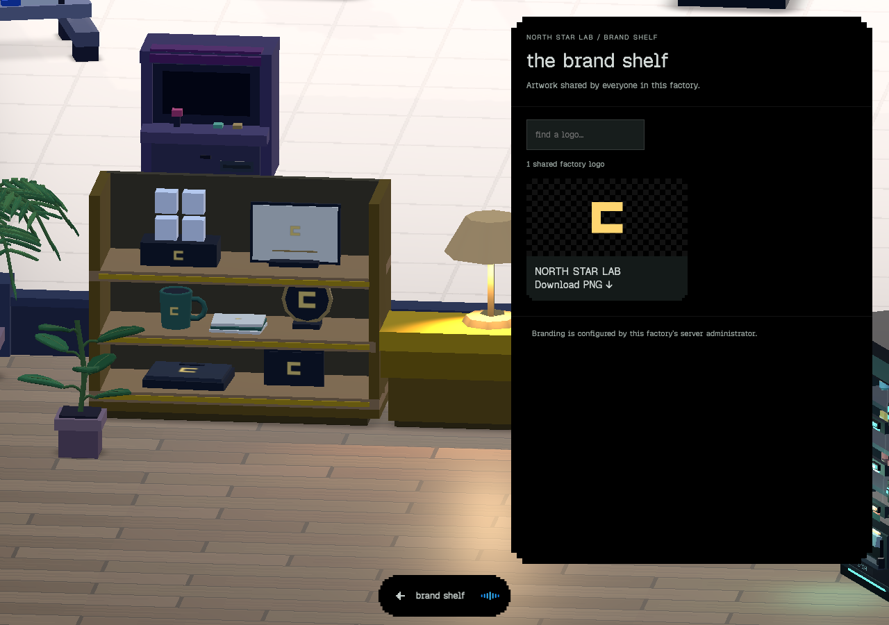
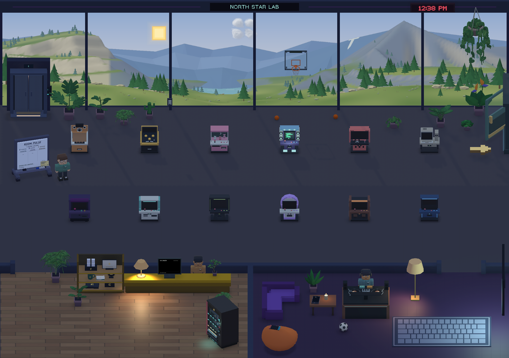

# Shared branding verification — September 13, 2026

## Change contract

The server operator configures one factory identity. Connected browser and native clients use its title, accent and optional PNG on their branding surfaces. Users do not maintain separate branding preferences. Default scenery is neutral. Changing or removing artwork must not require reinstalling the client; changing factories must not leave the previous factory’s branding behind.

This slice uses operator configuration, with restart/redeploy to apply it. It does not introduce a configuration-writing API, administrator role, cloud-mask editor, native patio flags, or change the app icon/publisher. Native distribution requires a subsequent app release containing the reader.

## Review and risks

Risk: high because this adds a public cross-client contract and factory-scoped asynchronous artwork. Self-review outcome: **Ready with disclosed risks**. No verified blocker remains; rollout and native packaging constraints are below.

| Invariant | Failure scenario | Evidence | Status |
| --- | --- | --- | --- |
| Only public identity leaves the server | Local paths or signing settings enter `/api/config` | Public-config allowlist test includes nested private fields | Proven |
| Images are bounded, normalized local PNGs | Malformed image, decompression load, external fetch | Header/dimension/input/output bounds; CRC decode/re-encode; local-file loader tests | Proven |
| Older consumers continue reading the title | Additive contract breaks existing clients | Legacy title tests and unchanged top-level title | Proven |
| Image replacement/removal is explicit | Cached artwork stays after operator removal | Content-addressed route; two-browser removal check; native removal test | Proven |
| Factory switches discard stale responses | Previous factory logo paints into a newly selected server | Native generation/path guards and switch tests | Proven |
| Artwork stays proportional | Logo is stretched on narrow signs | Native aspect-fit test and captured shelf surfaces | Proven |
| Recovery does not require a different title | Same identity is suppressed after a failed PNG | Unchanged-refresh regression test and guarded loader retry | Proven |
| Existing factory authorization is unchanged | Public branding introduces unauthenticated writes | Read-only public routes; operator file/environment is the sole writer | Proven by call-path inspection |
| All consumers eventually share one identity | Clients observe different revisions while a server restarts | Refresh within 60 seconds, focus/reconnect; propagation is eventual, not atomic | Explicit design constraint |

Review starts at `server/index.ts` → `server/branding.ts` → the `/api/config` allowlist in `server/routes/hooks.ts`. Then follow `watchFactoryIdentity` → `applyFactoryBranding` → scene texture subscriptions. Tests in `branding.test.ts`, `public-server-config.test.ts`, and `prototype-site.test.ts` cover the trust and compatibility boundaries. Native implementation is separately committed as `6f7486b` on `wolzey/ipad-visual-slice`; that divergent branch must not be merged into server main.

Self-review corrected a missing server entrypoint import before the feature commit, isolated Unity scene-test cleanup, guarded stale/native image removal, and restored browser artwork retries on unchanged configuration. Validation below follows those fixes.

## Evidence

- `pnpm test --maxWorkers=2`: **163 files, 1,305 tests passed**.
- `pnpm build`: **passed**. Existing Vite chunk-size warning remains.
- Native Unity tests: **132 passed**, including all three scene bindings and image/config lifecycle cases.
- `python3 scripts/build-unity.py mac-xcode`: **passed**; this is an Xcode export, not a newly signed/notarized distribution artifact.
- Python/Chromium smoke uses the actual server serializer, isolated API fixtures and two browser contexts. It forces an initial PNG failure for each client, verifies recovery on refresh, shared title/logo, shelf preview/download, interactive ink stir/scatter/reset and logo removal with a same-title revision.
- Images below were inspected. They use synthetic “NORTH STAR LAB” artwork. Browser preview controls/sample visitors are local fixtures; no production factory or account was contacted.

## Rollout and rollback

This feature is not deployed. Server/browser changes are isolated on `wolzey/factory-branding`. On approval, deploy that branch through main, supply operator configuration and verify `/api/config` plus its PNG URL. Existing clients must refresh/load the new browser assets; native clients need a new app package. The previously notarized neutral Mac candidate predates this feature.

To remove a logo, remove its file setting and restart. To roll back the feature, revert the server/browser commits; new native readers continue accepting a legacy title-only response. Unknown or malformed responses preserve the last valid identity only within the same factory. Invalid explicit operator configuration fails startup rather than silently changing the factory identity.

Physical-device acceptance of a new branded package and native patio flag parity remain follow-ups. No user/device records or database migrations are involved.
